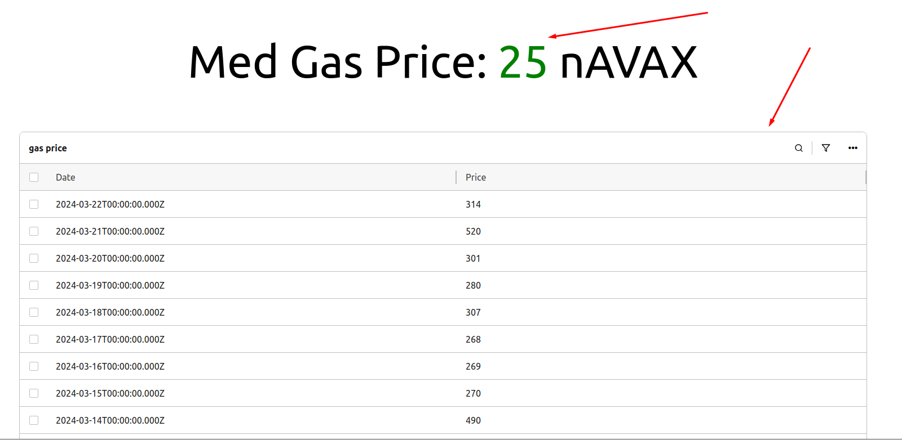

# Requirement

Every half hour, scrape the 'Med Gas Price' value from the network at https://snowtrace.io/, and store it in a database. React App : Write a frontend to display the gas price chronologically. It can be in the form of a table or a graph.

# How to install and exucute

# Frontend(Reactjs) 

-environment: node 21.5.0

-cd frontend and npm install

-npm run start

# Backend(Django Rest Framwork)

-environment: python 3.10.12

-cd backend/app and pip install -r requirement.txt

-python manage.py runserver

# Database

-postsqlgres

- Every 30 minutes, data be updated and stored.
